<!-- GENERATED FILE — do not edit by hand.
     Facts come from lib/ via tool/architecture/facts.dart.
     Narrative comes from tool/architecture/catalogue.dart.
     Regenerate with: dart run tool/gen_architecture.dart -->

# Actions and their background effects

Each entry pairs what the user perceives with what actually happens. In the diagrams a **solid arrow** is something the user caused and can perceive; a **dashed arrow** is background work they have no way of seeing. `opt` blocks are conditional.

> **On server-side facts.** Everything cited from `lib/` is validated on every regeneration. The **On the server** notes describe another repo and are hand-recorded: read from `doxa-campaigns-server` at `63eee8e` (master) on 2026-08-28. Re-check them when that repo moves.

## At a glance

| Surface | Action | Requests it can fire | Writes |
| --- | --- | --- | --- |
| Launch and background work | [Cold start](#cold-start) | `GET /api/people-groups/{slug}/prayer-content/{date}`<br>`GET /api/app/version`<br>`POST /api/collect/app` | `install_referrer_checked`<br>`referred_people_group_slug` |
| Onboarding wizard | [Welcome → Start](#welcome--start) | `GET /api/people-groups/detail/{slug}` | `referred_people_group_slug` |
| Onboarding wizard | [Confirm a people group](#confirm-a-people-group) | — | `selected_people_group_slug`<br>`selected_people_group_name`<br>`selected_people_group_image_url` |
| Onboarding wizard | [People-groups step → Skip](#people-groups-step--skip) | — | — |
| Onboarding wizard | [Reminder step → Save](#reminder-step--save) | — | `reminders` |
| Onboarding wizard | [News step → Sign up](#news-step--sign-up) | `POST /api/people-groups/{slug}/anon-signup`<br>`POST /api/news-signup`<br>`POST /api/push/register` | `identity_tracking_id`<br>`identity_profile_id`<br>`identity_subscription_id` |
| Onboarding wizard | [News step → Finish](#news-step--finish) | — | `wizard_completed` |
| Onboarding wizard | [News step → Skip](#news-step--skip) | `POST /api/people-groups/{slug}/anon-signup` | `identity_tracking_id`<br>`identity_profile_id`<br>`identity_subscription_id`<br>`wizard_completed` |
| Pray tab | [Open the Pray tab](#open-the-pray-tab) | `GET /api/people-groups/{slug}/prayer-content/{date}`<br>`POST /api/people-groups/{slug}/prayer-content/{date}/session`<br>`GET /api/people-groups/statistics` | — |
| Pray tab | [Tap Amen](#tap-amen) | `POST /api/people-groups/{slug}/prayer-content/{date}/session` | `prayer_history`<br>`thank_you_verse_index` |
| Pray tab | [Leave the Pray tab without tapping Amen](#leave-the-pray-tab-without-tapping-amen) | `POST /api/people-groups/{slug}/prayer-content/{date}/session` | `prayer_history` |
| Browse tab and group details | [Open the Browse tab](#open-the-browse-tab) | `GET /api/people-groups/list` | — |
| Browse tab and group details | [Group details → pray for this group](#group-details--pray-for-this-group) | `PUT /api/profile/{profileId}`<br>`POST /api/people-groups/{slug}/anon-signup` | `selected_people_group_slug`<br>`selected_people_group_name`<br>`selected_people_group_image_url`<br>`identity_subscription_id` |
| Reminders tab | [Add or edit a reminder](#add-or-edit-a-reminder) | `PUT /api/profile/{profileId}`<br>`POST /api/push/register` | `reminders` |
| Settings | [Settings → Sign up for updates → Sign up](#settings--sign-up-for-updates--sign-up) | `POST /api/news-signup`<br>`POST /api/push/register` | `identity_tracking_id`<br>`identity_profile_id` |
| Settings | [Enable notifications (prompt or settings row)](#enable-notifications-prompt-or-settings-row) | `POST /api/push/register` | — |
| Settings | [Settings → view signed-up emails](#settings--view-signed-up-emails) | `GET /api/profile/{profileId}` | — |
| Settings | [Settings → Resend verification email](#settings--resend-verification-email) | `POST /api/profile/{profileId}/resend-verification` | — |
| Settings | [Change language](#change-language) | `POST /api/collect/app` | `app_locale_language_code` |
| Settings | [Send feedback](#send-feedback) | `GET /api/profile/{profileId}`<br>`POST /api/feedback` | — |
| Update gate | [Dismiss the optional update banner](#dismiss-the-optional-update-banner) | — | `update_snooze_until`<br>`update_dismissed_version` |
| Update gate | [Start the update](#start-the-update) | — | — |
| Deep links and push taps | [Open an /app/<slug> share link](#open-an-appslug-share-link) | `GET /api/people-groups/detail/{slug}` | `referred_people_group_slug` |
| Deep links and push taps | [Open a /<slug>/prayer link](#open-a-slugprayer-link) | `GET /api/people-groups/{slug}/prayer-content/{date}` | — |
| Deep links and push taps | [Tap a push notification](#tap-a-push-notification) | — | — |

---

## Launch and background work

Nothing here is a button, but it sets the state every other action depends on — most importantly whether an identity exists yet.

### Cold start

Entered at `main` in [lib/main.dart](../../lib/main.dart).

**Visible** — Splash, then either the wizard or the home tab.

**Background** — Seven persisted values are loaded in parallel, then push is initialised, three listeners are installed that will later fire network calls on their own, the caches are warmed and pruned, an update check runs and an app_open event is posted.

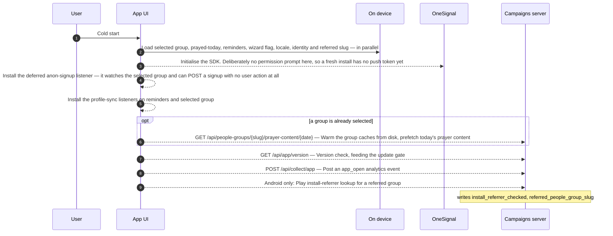


**Worth knowing**

- Push init is ordered **after** `loadIdentity()` on purpose, so the first `OneSignal.login()` uses the right external id.
- The install-referrer lookup is fire-and-forget but the welcome CTA awaits it (bounded to 5s), so a fast tapper cannot race it.
- Foreground resumes post a second `app_open` from `app_shell.dart`, so the event counts sessions, not launches.

---

## Onboarding wizard

The only place a prayer subscription is created, and the only place an email reaches `anon-signup`. Every step can be skipped, and skipping group selection simply defers that signup until the user picks a group later.

### Welcome → Start

Entered at `startFromWelcome` in [lib/services/wizard_controller.dart](../../lib/services/wizard_controller.dart).

**Visible** — A spinner on the CTA, then either the people-group list or the confirm step with a group already filled in.

**Background** — Waits up to 5 seconds on the Play install-referrer lookup. If an install referrer or deep link supplied a slug, that group is fetched and the list step is skipped entirely.

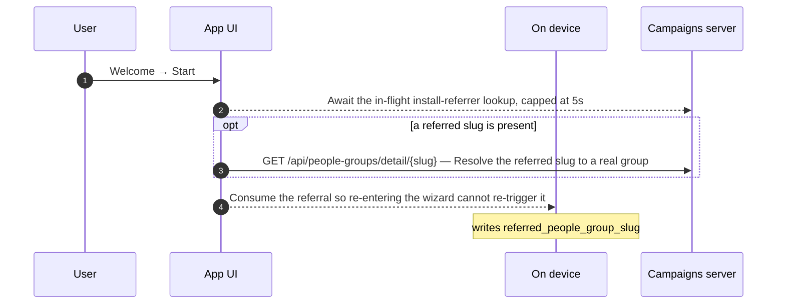


**Worth knowing**

- A referral arriving *mid-wizard* is handled by a listener instead, and only while the user is still on the list or confirm step — later steps are left alone so the user is not yanked backwards.

### Confirm a people group

Entered at `setSelectedPeopleGroup` in [lib/components/wizard/wizard_step_people_group_confirm.dart](../../lib/components/wizard/wizard_step_people_group_confirm.dart).

**Visible** — The wizard advances to the reminder step.

**Background** — Three prefs keys are written and two listeners fire — but both no-op at this point, because the wizard is not complete and there is no profile yet. The same tap after onboarding does hit the network.

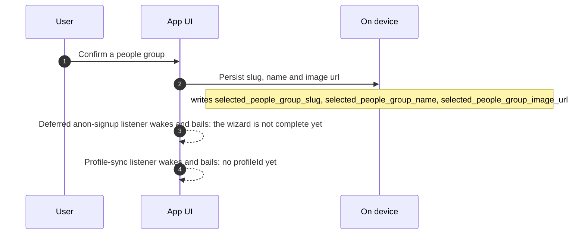


### People-groups step → Skip

Entered at `skipPeopleGroup` in [lib/components/wizard/wizard_step_people_groups.dart](../../lib/components/wizard/wizard_step_people_groups.dart).

**Visible** — The wizard moves on to the reminder step.

**Background** — Nothing is persisted and nothing is posted — and because `anon-signup` needs a slug, this user finishes onboarding with **no identity at all**. No tracking id, no profile, no prayer subscription, and push cannot register.

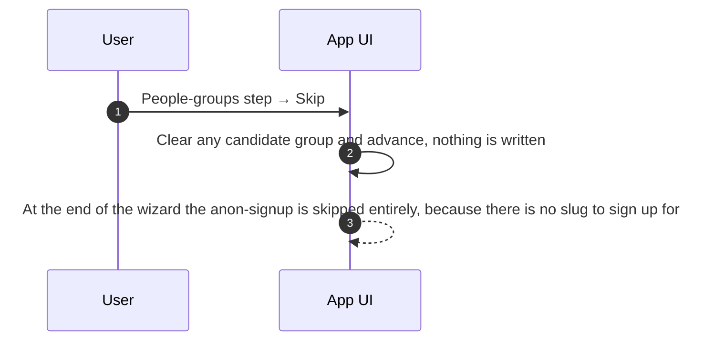


**Worth knowing**

- This is the only route to finishing onboarding with no identity, and it is the reason the settings news-signup can leave someone without a prayer subscription.
- They recover the moment they select a group anywhere in the app: the deferred anon-signup listener fires and posts the signup for them.

### Reminder step → Save

Entered at `_save` in [lib/components/wizard/wizard_step_reminder.dart](../../lib/components/wizard/wizard_step_reminder.dart).

**Visible** — The OS notification dialog, then the wizard advances to the news step.

**Background** — This is where push notifications are really enabled. Granting the permission nudges OneSignal to mint a token — with no second dialog — and that token would be registered with the server, except identity does not exist yet, so registration is skipped and only lands after the next step.

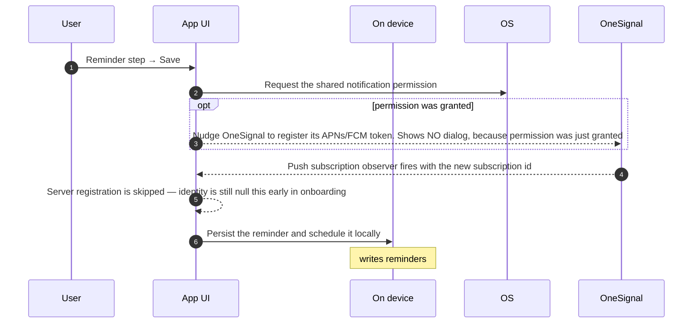


**Worth knowing**

- The OS notification permission is shared between `flutter_local_notifications` and OneSignal. The reminders flow owns it; the coupling to OneSignal is one-directional and intentional.
- A user who never touches reminders and never signs up therefore never becomes addressable by push, even though the SDK is initialised.

### News step → Sign up

Entered at `signUp` in [lib/services/wizard_controller.dart](../../lib/services/wizard_controller.dart).

**Visible** — A "check your email" confirmation, plus an enable-notifications offer.

**Background** — Two POSTs, in a load-bearing order. The anon-signup goes **first and carries the email the user just typed**, so the server resolves an existing subscriber by that address instead of minting an anonymous one. The news-signup then runs with the same tracking id. Gaining a profileId also re-points the OneSignal external id and finally registers the push token.

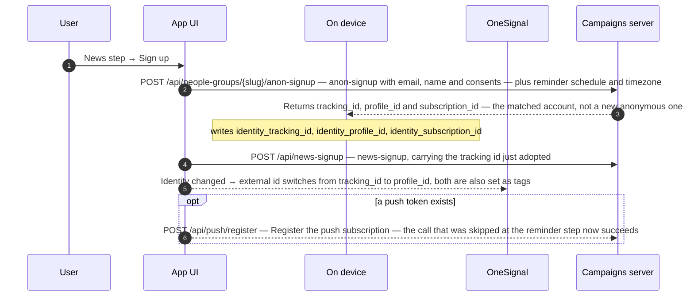


**On the server**

- `POST /api/people-groups/{slug}/anon-signup` — Because an email is present, the handler resolves the subscriber with `findOrCreateForNews` — literally the same resolver `/api/news-signup` uses — so an existing web subscriber with that address is matched instead of a new anonymous one being created. It then upserts the single `delivery_method = 'app'` subscription for (subscriber, people group).

**Worth knowing**

- Order is the whole mechanism: `_submitPeopleGroupSignup` runs before `submitNewsSignup`. Swapping them would change which record the server treats as canonical.
- The anon-signup is best-effort — its failure is logged and swallowed so onboarding is never blocked. A news-signup failure **is** rethrown so the step can offer a retry. So it is possible to end up with an email signup and no prayer subscription.
- Signing up does not complete the wizard. The user still has to tap Finish.

### News step → Finish

Entered at `_finish` in [lib/components/wizard/wizard_step_news_signup.dart](../../lib/components/wizard/wizard_step_news_signup.dart).

**Visible** — Onboarding ends and the home tab appears.

**Background** — Only marks onboarding complete. All the server work already happened when Sign up was tapped — but marking completion is what arms the deferred anon-signup listener for every later group change.

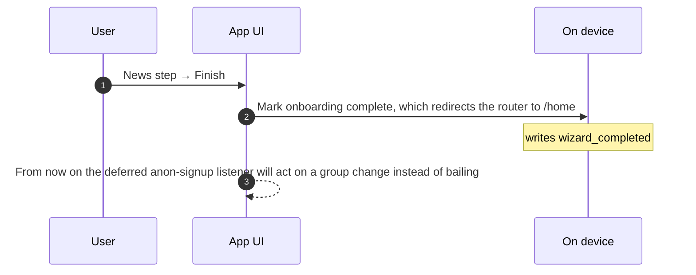


**Worth knowing**

- A user who taps Sign up and then kills the app without tapping Finish keeps their signup but stays in the wizard on next launch, because the router redirects on the `wizard_completed` flag alone.

### News step → Skip

Entered at `skip` in [lib/services/wizard_controller.dart](../../lib/services/wizard_controller.dart).

**Visible** — Straight to the home tab.

**Background** — Still posts an anon-signup — with empty email and no consents — so the user gets a prayer subscription and a server-minted tracking id. No email is sent and no newsletter consent is recorded.

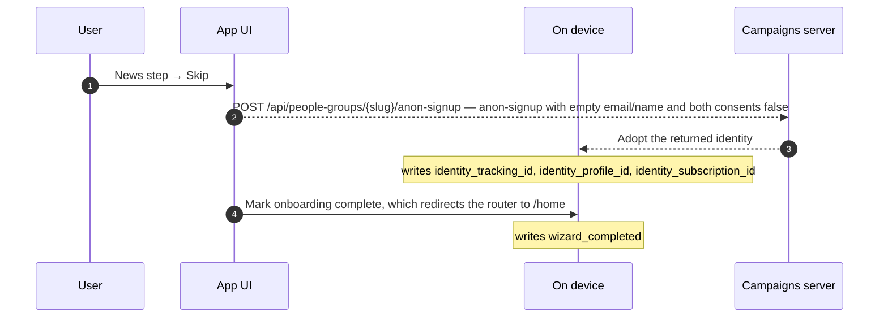


**On the server**

- `POST /api/people-groups/{slug}/anon-signup` — With no email the handler takes `findOrCreateByTrackingId`. The app sends an empty tracking_id, which fails the UUID test, so it falls through to creating a fresh subscriber named `Anonymous` with newly minted tracking_id and profile_id — then the app subscription for the group.

**Worth knowing**

- Skipping is not "no server contact" — it is a full anonymous signup. The only difference from the Sign up path is the absent email and the absent `news-signup` POST.

---

## Pray tab

Reads are cached per group/date/language. Writes are fire-and-forget and happen on leaving the screen as well as on Amen.

### Open the Pray tab

Entered at `_startSession` in [lib/components/prayer_content/prayer_session_view.dart](../../lib/components/prayer_content/prayer_session_view.dart).

**Visible** — Today's prayer content, usually with no skeleton.

**Background** — A session timer starts. Leaving the tab later posts that duration even if the user never taps Amen.

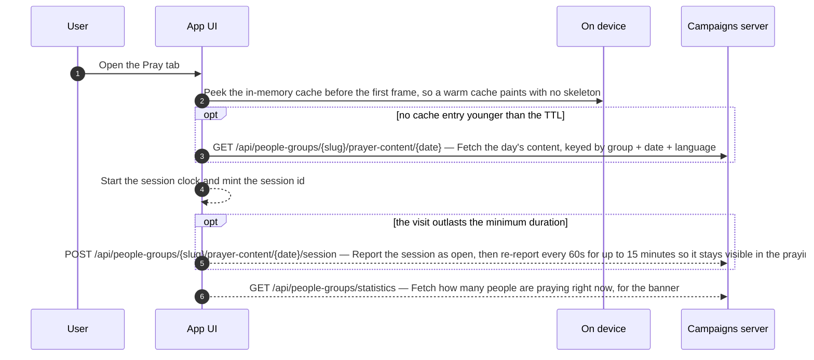


**Worth knowing**

- A past day's content never changes, so this is the one cached read with no background revalidation.
- The open report and every later ping upsert the SAME row server-side, keyed on the session id minted at start — so one visit is one row, whose timestamp tracks when the user was last seen.
- The praying-now count is read uncached on purpose: the shared response cache falls back to expired data when a refetch fails, which would show a stale live number rather than nothing.

### Tap Amen

Entered at `_onAmen` in [lib/components/prayer_content/prayer_session_view.dart](../../lib/components/prayer_content/prayer_session_view.dart).

**Visible** — The thank-you modal with a rolling verse.

**Background** — Posts the session duration against the id minted when the session started, then writes a local prayer record. Both are best-effort — a failure never reaches the user.

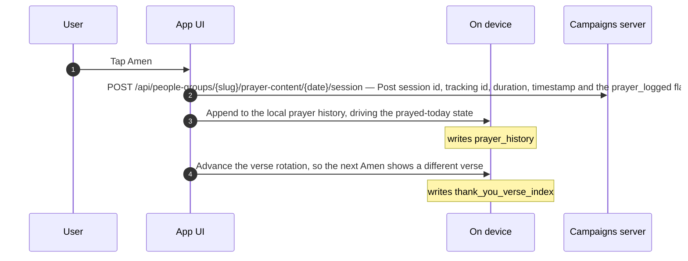


**Worth knowing**

- `postPrayerSession` is skipped on **any non-release build**, not just when the app secret is missing. Every other service skips only on a missing secret — so this is the one endpoint you cannot exercise from a debug or profile build.
- Only the Amen carries `track_event: prayer_logged`; the pings a running session makes leave it unset. The server, not the app, forwards that to the analytics backend — the app never talks to it directly.

### Leave the Pray tab without tapping Amen

Entered at `_endSession` in [lib/components/prayer_content/prayer_session_view.dart](../../lib/components/prayer_content/prayer_session_view.dart).

**Visible** — Nothing at all.

**Background** — The session is posted anyway, as long as it lasted longer than the minimum duration. Navigating away is treated as an implicit Amen.

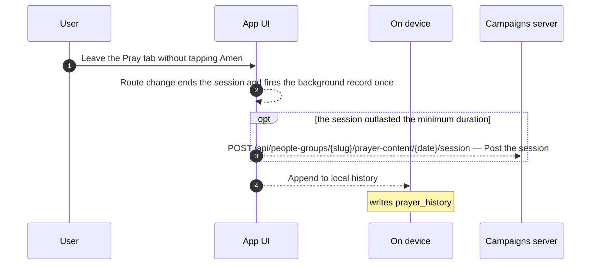


**Worth knowing**

- An `_amenFired` latch stops the tap and the leave path both recording the same session.

---

## Browse tab and group details

Long TTLs with a short background refresh, so counts move without the user ever waiting. Switching group here has server side effects.

### Open the Browse tab

Entered at `fetchPeopleGroups` in [lib/components/widgets/people_groups_list.dart](../../lib/components/widgets/people_groups_list.dart).

**Visible** — The UUPG list, usually instantly.

**Background** — The list is ~850 KB and cached for 7 days, but refreshed in the background once the copy is over an hour old so praying counts move. JSON decoding happens in a separate isolate to avoid dropped frames.

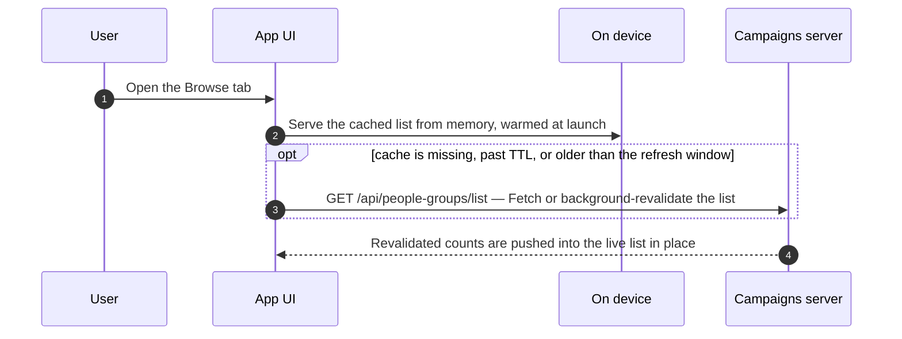


### Group details → pray for this group

Entered at `showSelectPeopleGroupConfirmation` in [lib/services/select_people_group_flow.dart](../../lib/services/select_people_group_flow.dart).

**Visible** — A confirm dialog, then the group becomes theirs.

**Background** — The single most consequential tap outside onboarding. For an existing subscriber it moves the prayer subscription to the new group. For someone who skipped group selection in the wizard it is the moment their anonymous subscriber is created server-side and the app gains an identity at last — which is also what finally lets push register.

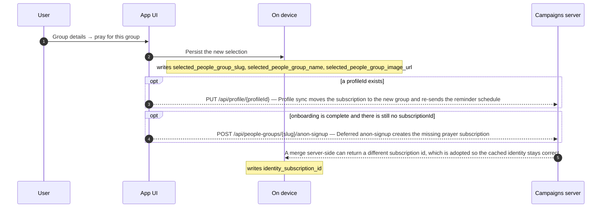


**On the server**

- `POST /api/people-groups/{slug}/anon-signup` — For a user who has no identity yet this is where their anonymous subscriber is created: empty tracking_id → `findOrCreateByTrackingId` → a fresh `Anonymous` subscriber, plus the app subscription. The app then adopts all three ids from the response.

**Worth knowing**

- Both background calls can fire from one tap, and both are best-effort: a failure is reported to Crashlytics and never shown, so the user believes the switch fully succeeded.
- This is the only path to a first prayer subscription outside the wizard, and the deferred listener does it with no extra UI — selecting a group is all the user has to do.

---

## Reminders tab

Local notifications only — but this is also the single place the OS notification permission is ever requested, which is what makes push work.

### Add or edit a reminder

Entered at `ensureNotificationPermission` in [lib/components/reminders/reminder_editor.dart](../../lib/components/reminders/reminder_editor.dart).

**Visible** — The reminder appears in the list; possibly an OS permission dialog.

**Background** — Asks for the shared notification permission and, on a grant, silently opts the device into OneSignal push. Then, if a profile exists, the whole reminder schedule is PUT to the server.

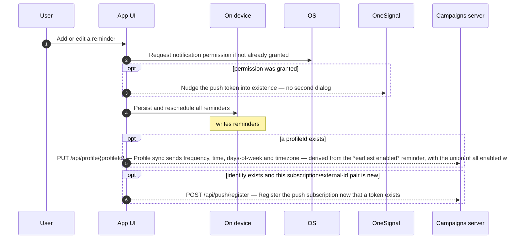


**Worth knowing**

- The server only ever learns one schedule, however many reminders the user has locally. Weekdays are converted from Dart's Mon=1..Sun=7 to the backend's Sun=0..Sat=6.
- Toggling, editing and deleting a reminder all trigger the same profile sync, because the listener is on the reminders controller rather than on any one button.

---

## Settings

The news-signup here looks like the wizard step but identifies the user differently — by tracking_id rather than by email — and leaves their prayer subscription alone.

### Settings → Sign up for updates → Sign up

Entered at `_onSubmit` in [lib/screens/news_signup_settings_screen.dart](../../lib/screens/news_signup_settings_screen.dart).

**Visible** — The same form and the same "check your email" confirmation as the wizard step, plus an enable-notifications offer.

**Background** — One POST, not the wizard's two — and that is fine. It carries the existing `tracking_id`, so the server updates the name and email on the anon user already on this device and **leaves their prayer subscription in place**. The app deliberately does not touch `subscriptionId`, because it already has the right one.

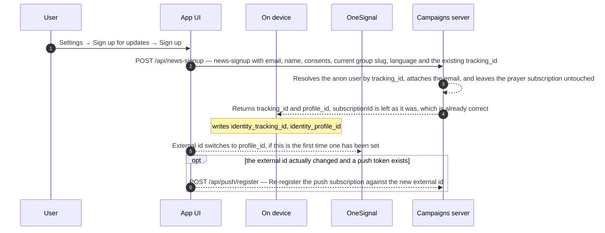


**On the server**

- `findOrCreateForNews` tries the email first, then the tracking_id: finding the device's anon subscriber it *adds* the email as a contact method and fills in the name only if the existing one is still blank or `Anonymous`. Nothing in this handler or in `applyEmailConsents` touches `people_group_subscriptions`, so the prayer subscription is untouched. It returns tracking_id and profile_id only.

**Worth knowing**

- The two signup screens differ in *how the server identifies the person* — by email in the wizard, by tracking_id here — not in whether a prayer subscription survives. It survives.
- A user who skipped group selection in the wizard has no `anon-signup` behind them, so this gives them a profile and still no prayer subscription — expected, since they have not chosen a group. Choosing one later posts the signup via the deferred listener.
- From this point on, every reminder edit and group switch silently PUTs the profile, because `profileId` is now set.
- The response is parsed for `tracking_id` and `profile_id` only. Any `subscription_id` the server returned would be discarded — harmless while the server leaves the subscription alone.

### Enable notifications (prompt or settings row)

Entered at `_onEnable` in [lib/components/notifications/enable_notifications_prompt.dart](../../lib/components/notifications/enable_notifications_prompt.dart).

**Visible** — The OS dialog, or the system settings app if permission was previously denied.

**Background** — This is the only push-facing control in the app, and it works by going through the reminders permission helper — so granting it also mints the OneSignal token and registers the device.

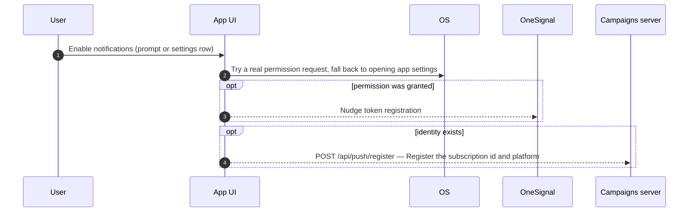


**Worth knowing**

- When the fallback to OS settings is taken, the grant lands *after* this returns; a lifecycle observer re-checks on resume.

### Settings → view signed-up emails

Entered at `fetchProfileEmails` in [lib/components/settings/account_settings_section.dart](../../lib/components/settings/account_settings_section.dart).

**Visible** — The email addresses signed up with, each shown verified or not, plus a link out to the web profile.

**Background** — Fetches the profile on every identity change and again on returning to the screen. Addresses arrive **redacted** from the server, so the app never holds them in full here.

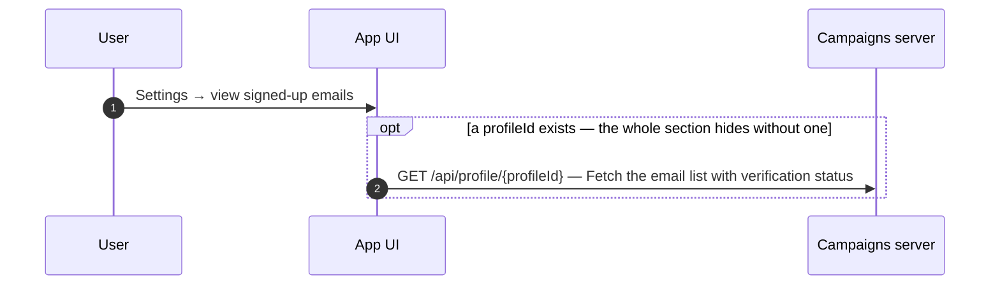


**Worth knowing**

- The same endpoint returns the primary address unredacted under `subscriber.email`; this list uses the redacted `emails` array instead.

### Settings → Resend verification email

Entered at `resendVerification` in [lib/components/settings/signed_up_email_tile.dart](../../lib/components/settings/signed_up_email_tile.dart).

**Visible** — A snackbar: sent, already verified, or a countdown to retry.

**Background** — Server-side rate limited. A 429 carries `retryAfterSeconds`, which drives the countdown on the button rather than surfacing as an error.

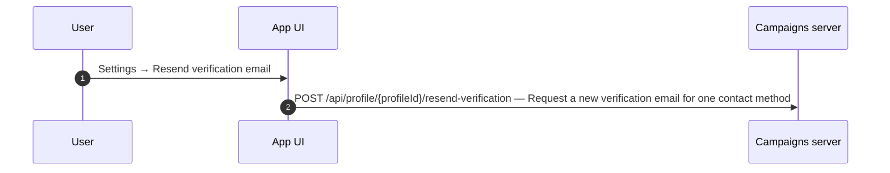


**Worth knowing**

- This call never throws — every failure maps to a status the UI can show, so a network problem looks the same as a refusal.

### Change language

Entered at `setLocale` in [lib/services/locale_controller.dart](../../lib/services/locale_controller.dart).

**Visible** — The UI switches language.

**Background** — Every cached read is keyed by language, so the whole content cache is effectively invalidated — the next Browse and Pray visit refetch. An analytics event records the switch.

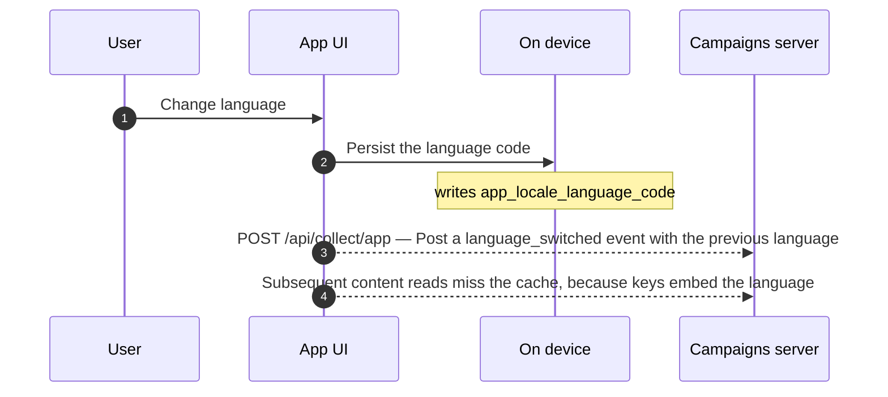


**Worth knowing**

- Language is *not* sent to the profile endpoint, so a signed-up user's email language is only set by whatever they signed up with.

### Send feedback

Entered at `submitFeedback` in [lib/services/feedback_service.dart](../../lib/services/feedback_service.dart).

**Visible** — A thank-you confirmation, or an inline rate-limit message.

**Background** — Attaches the tracking id, locale and a device diagnostics blob. If the user has a profile, the form is pre-filled by fetching their non-redacted primary email.

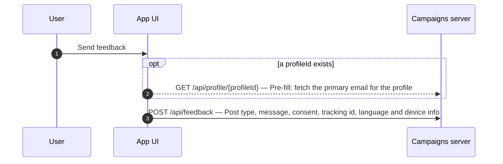


**Worth knowing**

- The profile endpoint returns email addresses redacted in its `emails` list but plaintext under `subscriber.email` — the pre-fill relies on the latter.

---

## Update gate

Wraps every screen. Its state comes from the launch version check, and dismissing it writes two separate suppression keys.

### Dismiss the optional update banner

Entered at `dismissOptionalUpdate` in [lib/components/misc/update_gate.dart](../../lib/components/misc/update_gate.dart).

**Visible** — The banner disappears.

**Background** — Writes **two** suppression keys: the dismissed version, so this version never nags again, and a shorter snooze timestamp that also suppresses the banner after a cancelled update attempt.

```mermaid
sequenceDiagram
    autonumber
    participant U as User
    participant UI as App UI
    participant L as On device
    U->>UI: Dismiss the optional update banner
    UI-->>L: Snooze the banner for a fixed window
    Note over L: writes update_snooze_until
    UI-->>L: Record the dismissed version, so only a newer release re-prompts
    Note over L: writes update_dismissed_version
```


**Worth knowing**

- A forced update has no dismiss path — the gate renders a blocking modal instead of a banner.
- The snooze key is written on a cancelled or failed update attempt too, not just on an explicit dismiss.

### Start the update

Entered at `startAppUpdate` in [lib/components/misc/update_gate.dart](../../lib/components/misc/update_gate.dart).

**Visible** — Android: the native in-app update flow. iOS: the store listing opens.

**Background** — No server call of its own — the target version came from the launch version check.

```mermaid
sequenceDiagram
    autonumber
    participant U as User
    participant UI as App UI
    participant OS as OS
    U->>UI: Start the update
    UI->>OS: Android uses Play in-app update (blocking when forced), other platforms deep-link to the store
```


---

## Deep links and push taps

Entry points that bypass the normal tab navigation.

### Open an /app/<slug> share link

Entered at `app-deep-link` in [lib/router.dart](../../lib/router.dart).

**Visible** — Either the group's detail page, or the wizard with that group pre-selected.

**Background** — Before onboarding the slug is stashed in prefs for the wizard to pick up, which is the same channel the Play install-referrer writes to.

```mermaid
sequenceDiagram
    autonumber
    participant U as User
    participant UI as App UI
    participant L as On device
    participant S as Campaigns server
    U->>UI: Open an /app/⟨slug⟩ share link
    opt onboarding is not complete
        UI-->>L: Stash the referred slug, then redirect into the wizard
    end
    Note over L: writes referred_people_group_slug
    opt onboarding is complete
        UI->>S: GET /api/people-groups/detail/{slug} — Otherwise go straight to the details page and fetch the group
    end
```


**Worth knowing**

- The share link is built with `ApiConfig.buildUri`, so a staging build shares a staging URL.

### Open a /<slug>/prayer link

Entered at `_prayDeepLinkRedirect` in [lib/router.dart](../../lib/router.dart).

**Visible** — The Pray tab showing that group, or a standalone prayer screen with a wizard CTA for a user who has not onboarded.

**Background** — For an onboarded user the group is stashed as a **one-visit override** rather than becoming their selection — so no subscription changes, and leaving the tab reverts it.

```mermaid
sequenceDiagram
    autonumber
    participant U as User
    participant UI as App UI
    participant S as Campaigns server
    U->>UI: Open a /⟨slug⟩/prayer link
    opt onboarding is complete
        UI-->>UI: Stash a one-visit pray override and redirect to /pray
    end
    UI->>S: GET /api/people-groups/{slug}/prayer-content/{date} — Fetch that group's content for the requested date
    UI-->>UI: Leaving the Pray tab clears the override
```


**Worth knowing**

- A prayer session posted while an override is active is attributed to the overridden group, not the user's own.

### Tap a push notification

Entered at `_onNotificationClick` in [lib/services/push_notifications_service.dart](../../lib/services/push_notifications_service.dart).

**Visible** — The app opens on a prayer page.

**Background** — The target is read from the notification payload — an explicit `route`, or a bare `slug` mapped to the prayer deep link. With neither, it falls back to the same sink local reminders use.

```mermaid
sequenceDiagram
    autonumber
    participant U as User
    participant UI as App UI
    participant OS1 as OneSignal
    U->>UI: Tap a push notification
    OS1->>UI: Click listener extracts a route from additionalData
    UI->>UI: Navigate via the pray deep-link route, so any group can be opened regardless of the user's own selection
    opt the payload carries neither route nor slug
        UI-->>UI: Generic push with no target → the local-reminder tap sink
    end
```
