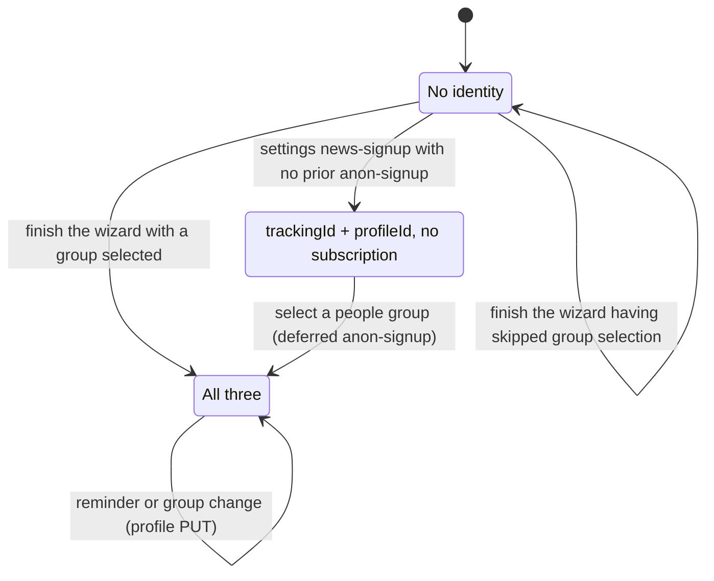
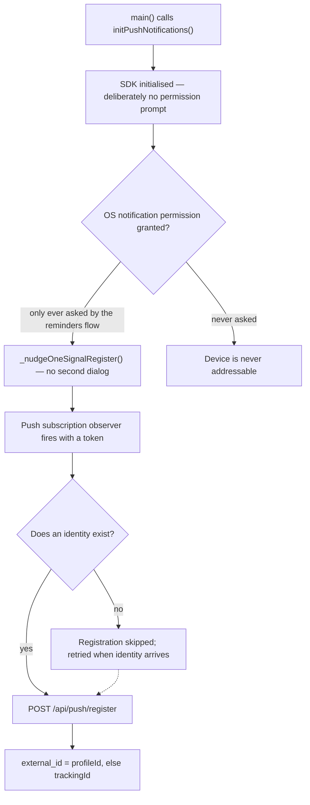

<!-- GENERATED FILE — do not edit by hand.
     Facts come from lib/ via tool/architecture/facts.dart.
     Narrative comes from tool/architecture/catalogue.dart.
     Regenerate with: dart run tool/gen_architecture.dart -->

# Identity, signup and push

Three fields decide what the app is allowed to do with the server. Which of them a user ends up with depends on a path they cannot see.

## The three fields

| Field | Stored as | Meaning |
| --- | --- | --- |
| `trackingId` | `identity_tracking_id` | Minted **by the server** on the first `anon-signup`, then persisted. The app never generates one — it posts an empty string and adopts what comes back. Every other call sends it. |
| `profileId` | `identity_profile_id` | The campaigns-server subscriber. Returned by `anon-signup` *and* by `news-signup`. Its presence is what unlocks profile sync and switches the OneSignal external id. |
| `subscriptionId` | `identity_subscription_id` | The prayer subscription for one people group. Set only from an `anon-signup` response. `news-signup` does not return one and does not need to: the server leaves an existing prayer subscription alone, so a later news-signup neither creates nor disturbs it. |

## States a device can be in

These are the states of the identity the **app** holds, which is what gates push registration and profile sync. They are not a claim about what rows exist server-side: analytics events and prayer sessions are posted with an empty identifier and their responses are never read, so the server may well hold an anonymous record the app knows nothing about. Note too that there is no state with a `trackingId` but no `profileId` — `anon-signup` returns both together.

| State | Reached how |
| --- | --- |
| `none` | No identity **held by the app**. Fresh install, and also where a user who skipped group selection in the wizard sits, since `anon-signup` needs a slug. An expected state, not a broken one — picking a group anywhere in the app resolves it. Until then push has no external id to register against. |
| `profiled` | trackingId + profileId, no subscription. Reached by a user with no prior anon-signup who signs up through settings. They are signed up for email and not praying for a group yet. |
| `subscribed` | All three. Where nearly everyone lands: selecting a group in the wizard always posts an `anon-signup`, whether they then sign up for news or skip it. |

## What writes which field

Derived from the catalogue, so it stays complete as actions are added.

| Key | Written by |
| --- | --- |
| `identity_tracking_id` | News step → Sign up; News step → Skip; Settings → Sign up for updates → Sign up |
| `identity_profile_id` | News step → Sign up; News step → Skip; Settings → Sign up for updates → Sign up |
| `identity_subscription_id` | News step → Sign up; News step → Skip; Group details → pray for this group |

## Wizard signup vs settings signup

These two screens show the same form. What differs is how the server identifies the person, not whether their prayer subscription survives.

| | Wizard news step | Settings → Sign up for updates |
| --- | --- | --- |
| Requests | `POST /api/people-groups/{slug}/anon-signup` **then** `POST /api/news-signup` | `POST /api/news-signup` only |
| Email reaches anon-signup | Yes — this is the mechanism | No |
| How the server finds the person | By the **email** in the anon-signup body, so an existing account is matched rather than a new anonymous one created | By the **tracking_id**, so it updates the anon user already on the device |
| Effect on name and email | Set as part of creating or matching the subscriber | Updated in place on the existing anon user |
| Effect on the prayer subscription | Created for the selected group | **Left in place, untouched** — it is neither created nor moved here |
| `profileId` after | Set | Set |
| `subscriptionId` after | Set from the response | Unchanged — already set for anyone who selected a group in the wizard |
| Leaves someone without a prayer subscription | No — it creates one | Only for a user who has not chosen a group yet, which choosing one fixes |

> In the wizard, the email is passed straight from the news-signup form into `submitAnonSignup`, and that is what makes the server return a matched account rather than a fresh anonymous one. The ordering in `WizardController.signUp` is load-bearing.

> In settings, the `tracking_id` does the identifying instead: the server finds the anon user already on the device, updates their name and email, and leaves the prayer subscription alone.

## How a device becomes push-addressable

Four links, none of which is a push setting the user can find. The chain breaks silently at any step.

| Link | Where | Note |
| --- | --- | --- |
| SDK init | `initPushNotifications` in [push_notifications_service.dart](../../lib/services/push_notifications_service.dart) | No-ops entirely when `ONESIGNAL_APP_ID` is unset. |
| Permission | `ensureNotificationPermission` in [reminders_notifications.dart](../../lib/services/reminders_notifications.dart) | The single OS permission is shared with local reminders. Reminders own it; push borrows it. |
| Token | `_nudgeOneSignalRegister` | Calls `OneSignal.Notifications.requestPermission(false)`. Because the OS permission is already granted this shows no dialog — it just opts the subscription in. |
| Registration | `_registerPushWithServer` | Returns early with no identity. De-duped on `subscriptionId\|externalId`, so it re-fires when the external id changes. |

The external id is `profileId` when there is one and `trackingId` otherwise, so **signing up changes a device's push identity** — `OneSignal.login()` is called again and the server row is re-registered. Both ids are also written as tags so the switch is traceable if it races.

## Entry points that ask for notification permission

All of these reach the same helper, and all of them therefore also enable push:

- `ensureNotificationPermission` in [lib/components/wizard/wizard_step_reminder.dart](../../lib/components/wizard/wizard_step_reminder.dart)
- `ensureNotificationPermission` in [lib/components/reminders/reminder_editor.dart](../../lib/components/reminders/reminder_editor.dart)
- `promptEnableNotifications` in [lib/screens/reminders_screen.dart](../../lib/screens/reminders_screen.dart)
- `promptEnableNotifications` in [lib/screens/notification_permission_settings_screen.dart](../../lib/screens/notification_permission_settings_screen.dart)
- `promptEnableNotifications` in [lib/components/notifications/enable_notifications_prompt.dart](../../lib/components/notifications/enable_notifications_prompt.dart)
- `EnableNotificationsPrompt` in [lib/components/widgets/news_signup_success.dart](../../lib/components/widgets/news_signup_success.dart)
