# Mobile app creation plan

## Intro

We will be creating a mobile prayer app that mirrors the prayer content available on pray.doxa.life.
The app will onboard the user to
* Choose a people group to pray for
* Set up a regular reminder to pray
* Choose their app language

Their homescreen will show
* the people group they have chosen to pray for
* the reminders they have set

There will be a top nav bar containing
* a centralised app logo
* a right aligned settings cog button

There will be a bottom navbar containing the links
* Home
* Pray
* People Groups
* Reminders

Clicking on the pray button takes the user to a prayer page.
It will contain the prayer content for that people group for that day, fetched from the pray.doxa.life APIs that we will define later.
The content contains block data that we will define how to render later.


## Phase 1

Claude to create a stubbed app for Android (and iOS)

### Technologies to use for phase 1

* Flutter
* Material

We will save saving app state til later.

## Phase 2 - Getting the design right

I have a well designed Adobe XD of how the app should look and work [here](doxa-prayer-app-mockup.pdf)
I want to use this phase to create a kitchen sink of components and make sure that they look correct.
The kitchen sink should be a new screen, and should be accessible via a button next to the settings cog.
Here is a list of components we will need.

### Components
* Top nav bar
  
* Bottom nav bar
  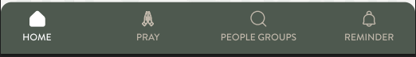
* Navbar buttons
  * Icon button
  
  * Icon button with text below
 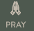
    * Selected state
  
* Action Button
   
   
   
   
   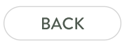
* CTA button
 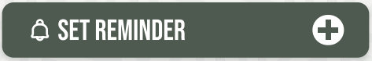
* Icon buttons (not on navbar) with text below
  
* Arrow buttons
  
  
* Button link
  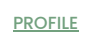
* Elevated Card
 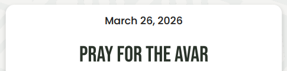
* Non elevated card
  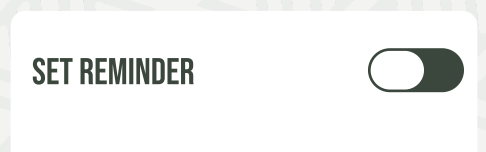
* Titles: h1, h2
  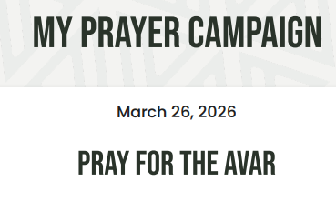
* Text Input fields
  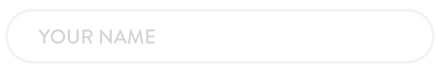
* search field
  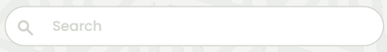
* Time input field
  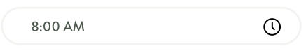
* Checkboxes
  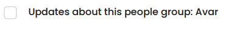
* Select fields
  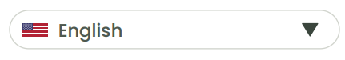
* Toggles
 
* Progress dots for wizard
 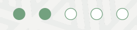
* Icons
 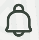
* Reminder card
  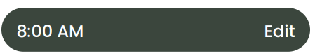
* Image
  

### Layouts
* Vertical spacing between elements
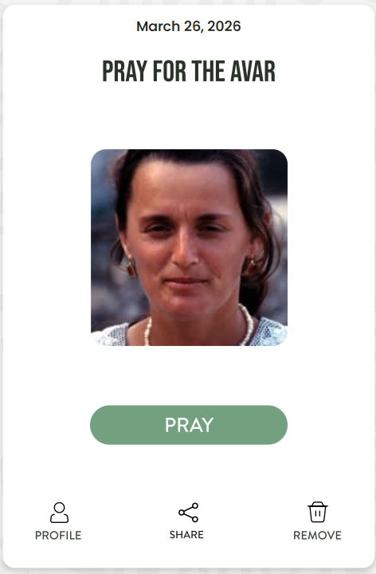
* Horizontal spacing between elements
  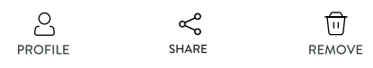
* Elements pushed apart as far as possible
  
* center aligned element
  
* People group card layout
  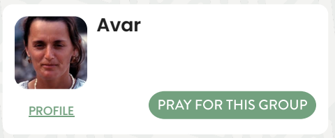
* vertically grouped buttons
 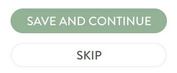
* consistent container width
 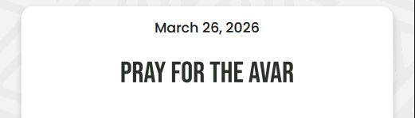

## Phase 3 Getting each section working well

### Tech requirements

* Ability to save app state
* Ability to request and manage local notifications for reminder system.
* API requests to fetch data, and to send data

### Home screen

If people group is selected it:
Contains a card with
* the name of the prayer campaign e.g. 'pray for the Avar'
* Image of the people group
* Action button 'Pray' that takes them to the 'pray' screen
* 3 icon buttons
  * profile --> to the people group details page
  * share --> opens up modal with QR code for others to join praying for this people group, and button to open native share
  * remove --> opens modal, to confirm whether the user wants to stop praying for this group. Puts the user back into a state of not having a people group selected.
Else if people group not selected
* has a CTA button to prompt the user to 'choose a people group' which takes them to the people group screen to select a people group

If the user has reminders set:
Shows a summary of their upcoming reminder
Else if not set
Shows a CTA button for them to set a reminder --> this takes them to the reminder screen

Has a support section with:
* a donate button
* a feedback button
* signup for updates (if they haven't already)

### Pray screen

Get's today's prayer content from
GET /api/people-groups/{slug}/prayer-content/2026-01-12?language=en HTTP/1.1
Host: pray.doxa.life
Where the slug is the people group slug
The returned data is of the form
```json
{
  "people_group": {
    "id": 1,
    "slug": "string",
    "title": "string",
    "default_language": "string"
  },
  "date": "2026-04-23",
  "language": "string",
  "availableLanguages": [
    "string"
  ],
  "content": [
    {
      "id": 1,
      "title": "string",
      "language_code": "string",
      "content_json": {},
      "content_date": "2026-04-23",
      "content_type": "string",
      "people_group_data": {}
    }
  ],
  "hasContent": true
}
```
En example output can be found in [this sample output](sample-prayer-api-output.json)

When the user clicks 'Amen' at the bottom of the prayer page, send a prayer report to the API

POST /api/people-groups/%7Bslug%7D/prayer-content/2026-01-12/session HTTP/1.1
Host: pray.doxa.life
Content-Type: application/json

{"sessionId":"","trackingId":"","duration":1,"timestamp":""}

With 200 return of
```json
{
  "success": true,
  "message": "string"
}
```

### Reminder screen

Allows the user to create new reminders.
It allows them to create multiple reminders by day of the week and time.

### People group Screen

Will contain the People group list component

### People group details screen

Will be a screen containing the details of the people group found at
GET /api/people-groups/detail/{slug}?locale=en HTTP/1.1
Host: pray.doxa.life

Example output from this api is
{
  "id": "string",
  "name": "string",
  "slug": "string",
  "display_name": "string",
  "image_url": "https://example.com",
  "picture_credit": [
    {
      "text": "string",
      "link": "string"
    }
  ],
  "population": 1,
  "people_praying": 1,
  "adopted_by_churches": 1,
  "people_committed": 1,
  "committed_duration": 1,
  "global_start_date": "2026-04-23",
  "imb_display_name": "string",
  "imb_alternate_name": "string",
  "imb_people_name": "string",
  "imb_people_description": "string",
  "imb_location_description": "string",
  "country_code": {
    "value": "string",
    "label": "string"
  },
  "region": {
    "value": "string",
    "label": "string"
  },
  "imb_subregion": {
    "value": "string",
    "label": "string"
  },
  "latitude": "string",
  "longitude": "string",
  "engagement_status": {
    "value": "string",
    "label": "string"
  },
  "primary_religion": {
    "value": "string",
    "label": "string"
  },
  "primary_language": {
    "value": "string",
    "label": "string"
  },
  "imb_reg_of_religion_3": {
    "value": "string",
    "label": "string"
  },
  "imb_reg_of_people_1": {
    "value": "string",
    "label": "string"
  },
  "doxa_wagf_region": {
    "value": "string",
    "label": "string"
  },
  "doxa_wagf_block": {
    "value": "string",
    "label": "string"
  },
  "additionalProperty": "anything"
}

This screen will have a back button in the left of the top navbar to allow the user to exit the details screen back to where they were

### Settings screen

When the user clicks on the cog in the top nav bar go to this screen.
This screen will have options like
* change language selector --> these languages will be got from the API
* manage permissions e.g. notification permission
* app version number at bottom of settings screen

### Wizard (when user first starts app)

Has several steps
1. How it works step
2. Choose a people group step (uses the people group list component)
   1. has a confirm step when they select a people group with 'back' or 'continue' button
3. Set prayer reminder
   1. Reminder selection and 'save and continue' and 'skip' buttons
4. Sign up for updates
   1. takes name and email address, and checkboxes for updates on the people group, and updates from doxa. then 'skip' or 'finish' buttons

### People group list component

This component pulls the list of people groups from the pray.doxa.life/api/peoplegroups/list endpoint.
It has an action button to allow the user to scan a QR code to find the people group
or
Use the search bar to filter the people group list
or
scroll the list.
The list has a total at the top, and a list of People group cards.
The cards have a picture of the people, their name, and 2 links.
If they click on the profile link button, it takes them to the Details page for that people group.
If they click on 'pray for this group' action button, then it selects that people group as the one that the user has selected to pray for and stores it in their user choices.
The people group list component will show up in the wizard, and when a people is selected, it should move the wizard onto the next step.
If they are on the people group screen however clicking 'pray for this group' will just mark the group as selected.

## Phase 4 Functionality

Getting the notifications to work correctly in all circumstances.
Getting the reminder notifications to deeplink back into the app.
Testing that the QR code deep linker works well.
Testing all the functionality on different devices.